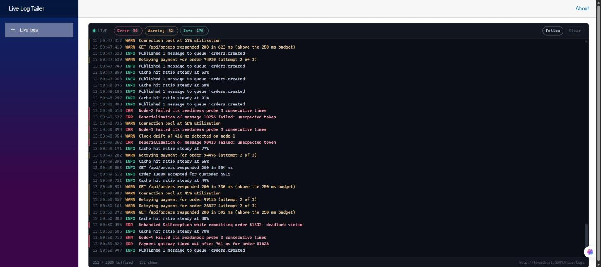
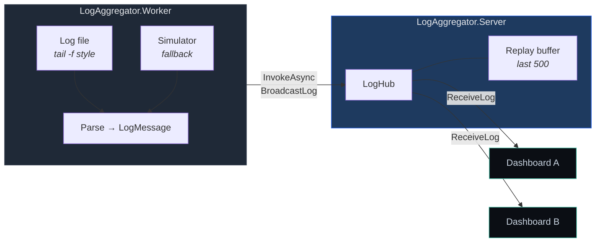
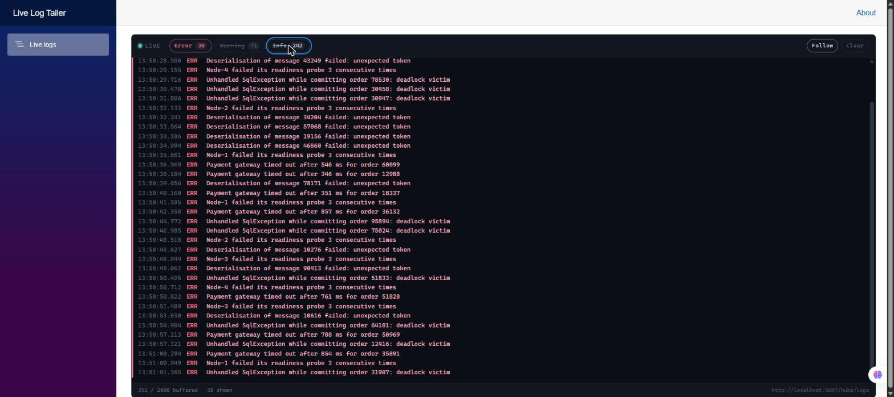

<div align="center">

# 📡 Real-Time App Log Aggregator

**A distributed live log dashboard built on .NET 10 — Worker Service → SignalR → Blazor.**

Tail a log file on one machine, watch it stream into a terminal-style web dashboard on another,
and filter by level instantly without a server round trip.

[](https://dotnet.microsoft.com/)
[](https://learn.microsoft.com/dotnet/csharp/)
[](https://learn.microsoft.com/aspnet/core/signalr/introduction)
[](https://learn.microsoft.com/aspnet/core/blazor/)
[](LICENSE)



</div>

---

## Table of contents

- [Why](#why)
- [How it works](#how-it-works)
- [Quick start](#quick-start)
- [Tailing a real log file](#tailing-a-real-log-file)
- [Features](#features)
- [Project layout](#project-layout)
- [Configuration](#configuration)
- [Building it yourself from scratch](#building-it-yourself-from-scratch)
- [Design notes](#design-notes)
- [Contributing](#contributing)
- [License](#license)

## Why

Reading logs over SSH with `tail -f` works until you have more than one machine, more than one
person looking, or a level you want to mute. This project is the small version of the thing you
actually want: a process that watches log files where they live, a hub that fans entries out, and a
browser dashboard anyone can open.

It is also a compact, runnable reference for wiring the three pieces together — `BackgroundService`,
a SignalR hub, and a Blazor component acting as a SignalR *client* — which is fiddlier in practice
than any single tutorial suggests.

## How it works



All three processes share **`LogAggregator.Shared`**, which holds the `LogMessage` record and the
hub method names — so the producer, the hub, and the consumer cannot drift apart.

## Quick start

**Prerequisites:** [.NET 10 SDK](https://dotnet.microsoft.com/download/dotnet/10.0) (`dotnet --version` ≥ `10.0.100`)

```bash
git clone https://github.com/Yassiinee/LogAggregator.git
cd LogAggregator
dotnet build
```

Then start the three processes — **in any order**, since the worker and the UI both retry until the
hub is reachable:

```bash
dotnet run --project src/LogAggregator.Server      # hub    → http://localhost:5007/hubs/logs
dotnet run --project src/LogAggregator.Worker      # producer
dotnet run --project src/LogAggregator.BlazorUI    # dashboard → http://localhost:5114
```

Open **<http://localhost:5114>**. With no log file configured the worker generates realistic
synthetic traffic, so the dashboard fills immediately with nothing else to set up.

## Tailing a real log file

Point the worker at any `.txt` log and it switches from simulation to real file tailing:

```bash
# bash / zsh
LogSource__Mode=File \
LogSource__FilePath="$(pwd)/samples/app.log.txt" \
  dotnet run --project src/LogAggregator.Worker
```

```powershell
# PowerShell
$env:LogSource__Mode = "File"
$env:LogSource__FilePath = "$PWD/samples/app.log.txt"
dotnet run --project src/LogAggregator.Worker
```

Append a line and watch it land in the browser:

```bash
echo "2026-07-28 10:31:04.001 [ERROR] Payment gateway timed out" >> samples/app.log.txt
```

<details>
<summary><b>Log line formats the parser understands</b></summary>

```
2026-07-28 09:15:02.123 [ERROR] message      ← bracketed level
2026-07-28T09:15:02Z [WARN] message          ← ISO 8601 with offset
2026-07-28 09:15:02,900 [Information] msg    ← comma fractional seconds
(FATAL) message                              ← parenthesised
WARN: message                                ← delimited by colon
```

Levels are collapsed onto **Info / Warning / Error** (`FATAL`, `CRIT`, `ERR` → `Error`;
`WRN`, `WARN` → `Warning`, and so on).

A line the parser cannot classify is still published — as `Info`, stamped with the current time —
because silently dropping log lines is worse than mislabelling one. The level must be *delimited*
to count, so a message like `Information about the deployment` stays a message rather than
becoming a level.

</details>

## Features

| | |
|---|---|
| 🖥️ **Terminal aesthetic** | Black background, monospace, colour-coded levels, error/warning gutter bars |
| 🔻 **Auto-scroll that behaves** | Follows the tail, releases the moment you scroll up to read, re-engages at the bottom — like `less +F` |
| 🎚️ **Instant level filters** | Pure client-side; toggling a level never touches the hub, and the buffer is untouched so nothing is lost |
| 📄 **Real file tailing** | Incremental UTF-8 decode emits only *complete* lines, never a half-written one |
| 🔄 **Rotation-aware** | Detects truncation and replacement, then reopens — instead of going silent forever |
| 🔌 **Order-independent startup** | Both clients retry the initial connect with backoff; `WithAutomaticReconnect` covers the rest |
| ⏮️ **History replay** | A dashboard opened late gets the last 500 entries, so a refresh isn't a blank screen |
| ⚡ **Flood-tolerant** | Renders coalesce at 100 ms and bursts publish as batches, so a log storm doesn't lock the UI |
| 🔒 **Non-intrusive reader** | Opens with `FileShare.ReadWrite \| Delete` — never blocks the app doing the logging |

### Filtering in action

Muting Warning and Info leaves only errors. Note the footer: **351 buffered, 38 shown** — filtering
is a view concern, so nothing is discarded and un-muting brings it all straight back.



## Project layout

```
LogAggregator/
├─ src/
│  ├─ LogAggregator.Shared/            # The wire contract, referenced by all three
│  │  ├─ LogMessage.cs                 #   record: Timestamp (UTC) · LogLevel · Message
│  │  ├─ LogLevels.cs                  #   canonical levels + Normalize()
│  │  └─ LogHubContract.cs             #   hub path & method names, single source of truth
│  │
│  ├─ LogAggregator.Server/            # ASP.NET Core host for the hub
│  │  ├─ Hubs/LogHub.cs                #   Hub<ILogClient> — fan-out + replay on connect
│  │  ├─ Hubs/ILogClient.cs            #   strongly-typed client surface
│  │  └─ Services/LogBuffer.cs         #   bounded thread-safe ring buffer
│  │
│  ├─ LogAggregator.Worker/            # BackgroundService producer
│  │  ├─ Worker.cs                     #   the loop: connect → read → publish
│  │  ├─ LogLineParser.cs              #   GeneratedRegex line → LogMessage
│  │  ├─ LogSourceOptions.cs           #   bound & validated at startup
│  │  └─ Sources/
│  │     ├─ LogFileTailSource.cs       #   real tail -f, rotation-aware
│  │     └─ SimulatedLogSource.cs      #   weighted synthetic traffic
│  │
│  └─ LogAggregator.BlazorUI/          # Blazor Web App (InteractiveServer)
│     ├─ Components/Pages/
│     │  ├─ LogTerminal.razor          #   the dashboard
│     │  └─ LogTerminal.razor.css      #   scoped terminal styling
│     └─ wwwroot/js/terminal.js        #   scroll helpers (JS module)
│
├─ samples/app.log.txt                 # Sample file for Mode: File
└─ LogAggregator.slnx
```

## Configuration

<details open>
<summary><b><code>LogSource</code></b> — <code>src/LogAggregator.Worker/appsettings.json</code></summary>

| Key | Default | Meaning |
|---|---|---|
| `ServerBaseUrl` | `http://localhost:5007` | Hub host; the path comes from `LogHubContract.Path` |
| `Mode` | `Auto` | `Auto` (file if it exists, else simulate) · `File` · `Simulate` |
| `FilePath` | `logs/app.log.txt` | File to tail, relative to the worker's working directory |
| `ReadExistingContentOnStartup` | `false` | `true` republishes the whole file instead of tailing from the end |
| `FilePollMilliseconds` | `400` | How often to check for appended bytes |
| `SimulationIntervalMilliseconds` | `800` | Synthetic entry interval |
| `MaxBatchSize` | `50` | Entries per hub invocation |

</details>

<details>
<summary><b><code>LogHub</code></b> — <code>src/LogAggregator.BlazorUI/appsettings.json</code></summary>

| Key | Default | Meaning |
|---|---|---|
| `ServerBaseUrl` | `http://localhost:5007` | Hub host |
| `MaxVisibleEntries` | `2000` | Ring-buffer size before the oldest lines drop off |
| `RenderIntervalMilliseconds` | `100` | Renders are coalesced to this interval |

</details>

<details>
<summary><b><code>LogHub</code></b> — <code>src/LogAggregator.Server/appsettings.json</code></summary>

| Key | Default | Meaning |
|---|---|---|
| `BacklogSize` | `500` | Entries replayed to a newly connected dashboard |
| `AllowedOrigins` | Blazor dev URLs | CORS origins — only needed for browser-hosted clients |

</details>

Any key can be overridden by environment variable using `__` as the separator, e.g.
`LogSource__Mode=Simulate`.

## Building it yourself from scratch

<details>
<summary>The full <code>dotnet new</code> sequence that produced this solution</summary>

On .NET 10, `dotnet new sln` emits the XML **`.slnx`** format by default rather than the classic
`.sln`. Add `--format sln` if you need the old one for older tooling.

```bash
dotnet new sln -n LogAggregator

dotnet new classlib -n LogAggregator.Shared   -o src/LogAggregator.Shared   -f net10.0
dotnet new web      -n LogAggregator.Server   -o src/LogAggregator.Server   -f net10.0
dotnet new worker   -n LogAggregator.Worker   -o src/LogAggregator.Worker   -f net10.0
dotnet new blazor   -n LogAggregator.BlazorUI -o src/LogAggregator.BlazorUI -f net10.0 \
    --interactivity Server --all-interactive

dotnet sln add src/LogAggregator.Shared/LogAggregator.Shared.csproj \
               src/LogAggregator.Server/LogAggregator.Server.csproj \
               src/LogAggregator.Worker/LogAggregator.Worker.csproj \
               src/LogAggregator.BlazorUI/LogAggregator.BlazorUI.csproj

# Everyone references the shared contract
dotnet add src/LogAggregator.Server/LogAggregator.Server.csproj     reference src/LogAggregator.Shared/LogAggregator.Shared.csproj
dotnet add src/LogAggregator.Worker/LogAggregator.Worker.csproj     reference src/LogAggregator.Shared/LogAggregator.Shared.csproj
dotnet add src/LogAggregator.BlazorUI/LogAggregator.BlazorUI.csproj reference src/LogAggregator.Shared/LogAggregator.Shared.csproj

# The hub needs no package — SignalR ships in the ASP.NET Core shared framework.
# Only the two SignalR *clients* need one.
dotnet add src/LogAggregator.Worker/LogAggregator.Worker.csproj     package Microsoft.AspNetCore.SignalR.Client
dotnet add src/LogAggregator.BlazorUI/LogAggregator.BlazorUI.csproj package Microsoft.AspNetCore.SignalR.Client
```

</details>

## Design notes

Decisions that aren't obvious from the code, and the reasoning behind them:

- **Timestamps travel as UTC**, rendered with `ToLocalTime()`. For a dashboard whose whole premise
  is aggregating across machines, local timestamps on the wire are a bug waiting to happen.
- **`WithAutomaticReconnect` does not cover the *first* connect.** It only re-establishes a
  connection that succeeded once. Both clients therefore retry `StartAsync` with exponential
  backoff — which is what makes start order irrelevant.
- **The tailer emits only complete lines.** Bytes are decoded incrementally and a partially written
  trailing line stays buffered until its newline arrives, so you never see a truncated fragment.
  A naive `ReadLine` loop returns whatever precedes EOF, newline or not.
- **Rotation needs explicit handling.** `FileShare.Delete` means the read handle survives the file
  being replaced — still pointing at the old, now-orphaned file. The tailer compares the creation
  stamp at the path and reopens.
- **The UI coalesces renders** rather than repainting per message; without that, a log flood makes
  the page unusable. Rows are keyed by sequence number so evicting an old entry doesn't make the
  renderer rewrite every visible row.
- **Level filter chips are real `<input type="checkbox">`** elements, visually hidden rather than
  replaced by `<div>`s, so keyboard navigation and screen-reader semantics survive the styling.
- **A publish failure retries instead of dropping.** The source is a file that can be re-read, and
  losing lines to a brief hub restart would defeat the point of the tool.

## Contributing

Issues and pull requests are welcome. For a change of any size, please open an issue first so we
can agree on the approach.

```bash
dotnet build      # must be clean — the solution builds with 0 warnings
```

## License

Released under the [MIT License](LICENSE). Copyright © 2026 Yassine Zakhama.
